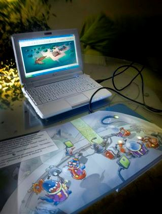

# Welcome to Robotoons!

Hello and welcome to the Robotoons GitHub repository!

At Robotoons, we're passionate about blending hardware with ***robotics***, ***electronics***, and ***artificial intelligence*** to create groundbreaking **narrative experiences** and **innovative gameplay**. Our mission is to seamlessly integrate video game mechanics with storytelling for young audiences, powered by cutting-edge electronic and robotic technologies.

## Our Vision

We strive to combine the immersive gameplay of video games with captivating storytelling, using **open-source** software and firmware. This approach allows everyone to modify, enhance, and expand upon our creations, fostering a community of innovation and collaboration.

## What You'll Find Here

In this GitHub repository, you'll discover the code for **BookLed**—a traditional paper book that's enhanced with generative AI to deliver a unique augmented reality experience. But that's not all—stay tuned for **BoSMi**, the robotic mouse that’s set to revolutionize interactive storytelling and play. Exciting times are ahead, and we can't wait to share them with you!

## Where to Buy the Hardware

You can purchase the open hardware for BookLed directly from our store on [Tindie](https://www.tindie.com/products/robotoons/bookled/). Get ready to dive into a new world of augmented storytelling and creative play with Robotoons!
<!---
robotoons/robotoons is a ✨ special ✨ repository containing open FW and open SW for Robotoons open HW products.
--->
